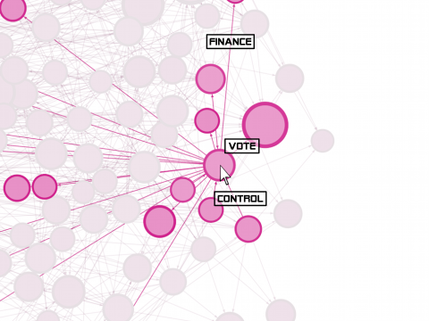

[translate me!](https://translate.google.com/translate?hl=&sl=auto&u=https%3A%2F%2Fgithub.com%2FDfred%2FCollaSyst%23readme)

# CollaSyst
Standing for Collaborative Systems, CollaSyst is a system modeler/visualizer for distributed and interactive decision-making.
Based first on Gephi (https://gephi.org) as a standalone solution, the aim is to eventually create a deployable web-based solution for real-time collaboration, wiki-style.

__Quick links:__
* Collaborative documentation: https://github.com/Dfred/CollaSyst/wiki
* General design: https://github.com/Dfred/CoSyE/wiki/Design
* Developpers: https://github.com/Dfred/CoSyE/wiki/Contributing
* Users: https://github.com/Dfred/CoSyE/wiki/User-Documentation

## Features
* graph-based knowledge management:
  * single-tag nodes and links;
  * addition, edition, deletion of nodes and links;
  * sequenced mutations (such as time-based animations);
  * visualisation and browsing:
    * node and link search;
    * dynamic layer creation with filtering and search results;
    * stackable layers;
  * optional requirements:
    * source link;
    * source material;
* edition:
  * user registration;
  * group management;
  * profiles:
    * expertise;
    * consent of delegation;
    * notifications;
  * traceability and validation:
    * versionned modifications (diff, timestamp, etc.);
    * peer review;
* simulation:
  * directed links can represent streams (money, people, resources, etc.);
  * nodes can split, fuse or transform streams;
  * streams sources can be fed with data:
    * from previous studies, and be used to refine graphed models;
    * from estimates or projections, and be used to simulate effects;
* pluggable to third-party software:
  * exportable data;
  * optional encryption;
  * optional ledger (blockchain)

# Problem
To design or manage a complex system (such as a governement, traffic control, particular economy...) Humans usually acknowledge the need to gather individual expertise for robust decision making: a decision that satisfies the interest of the collective - the collaborative individuals - and that prevents its own collapse. However collaboration within large group is not easy: collecting, sharing and compiling trusted information is a challenge.

### Informed design
For a group to act collaboratively and collegialy, every group member who wants to take a reasoned decision should have access to the necessary information. 
Each individual might focus on a different aspect of the problem, or work at a specific level of abstraction.
Also, because information is better understood through multiple perspectives, information representation should be dynamic: switching from one perspective to another should be effortless and realtime.

### Unbiased management
Because group dynamics often let a leader emerge, such leader’s biases impact the whole group once the leader makes the decision for the group. Not only is this leader rarely benevolent (favoring group interest), but over time internal and external influences build up and apply pressure to the leader, steering the leading individual away from alleged initial benevolence.
Hence, the bigger the potential consequences of a group decision, the more bias-free, informed and representative of the collective’s intentions the decision should be.

# Principled solution
Ideally, a collective decision should :

1. emerge from the collection of informed individuals;
1. be reasoned through formalization (i.e: structured and functional);
1. be laid out with quantified and qualified objectives to measure its effects;
1. be simulated so that the impact of changing initial conditions can be projected.

To this end, a collaborative decision making platform could be helpful, and would aim at:
1. reducing the time needed to acquire prerequisite knowledge with a graphical approach;
1. allowing the consultation and input of an arbitrarily vast group;
1. enforcing trust through citations and traceability of information;
1. storing generated data over a blockchain (for trust, availability, …).

Every resource of the system (such as money, people, energy source...) can be represented with a node. Grouping co-functional nodes together allows collapsing their complexity into an abstract node: a node with inputs and outputs to other functional elements outside of the group.

Every transfer inside and outside the system can be represented with directed flows (inputs or outputs), and flow transformers (functional elements/nodes) of various effect. 

## Use case: defining a new governmental policy
For instance, a democratic government usually consists of 3 main bodies: Executive, Legislative and Judiciary. At the highest level of abstraction, these are 3 distinct abstract nodes linked together by many flows (money, decisions, people, etc.) CollaSyst thus allows descending one level of abstraction by zooming into any of these 3 nodes until it opens-up to reveal all its constitutive nodes and internal flows. 
One could then focus on a particular aspect of the exposed internals by filtering the visualisation with masks/filters such as: all "non-people" flows, or "activated every 2 years".

Describing the current governmental system could be acheived through collaboration of non-experts and validating experts all of whom create nodes and their typed flows. Alledgedly non-experts would collaborate using general knowledge (for instance, basic individual tax system), whereas experts would review, fix and complete specific nodes belonging to their area of expertise.

A new governmental policy could then be formalised into a modification of the existing structure, explicitly revealing its mode of operation. A policy's effects could then be simulated by feeding the overall modified system with data representative of usual expectations (money received from taxes, coming from and/or given to foreign parties).

# Proposed software solution

Considering parts of the above scenario can be implemented with Gephi, it sounds more reasonable to build upon Gephi until a satisfying mature version of CollaSyst emerges, and then transfer the result to the web using appropriate technologies.

## Building upon Gephi
Existing solutions such as Gephi already provide a rich set of tools for importing, editing, visualising and exploring data. However with data scientists as the target audience for this software, its interface and features represents an incredibly difficult challenge for the layman to start effectively editing or visualising the data describing the system.
Also the project aiming at realtime online collaboration, it needs to endow Gephi with addtional plugins to depart from that standalone solution.

This project can be split in two stages: 
1. adapting towards simplicity Gephi's user interface and developing plugins to provide the most accessible interface to non-experts;
1. creating a deployable server-side solution, compatible with - and visually as much similar as possible to the result of - the standalone stage.

## Roadmap
1. Standalone milestone, providing:
 * various levels of GUI simplifications so a novice user's learning curve stays optimal;
 * multi-level boxes for grouping nodes (think encapsulation);
 * tagged links between nodes (already tagged);
 * tag-dependant (for node and/or boxes) views;
 * installation scripts and/or packaging
2. Web milestone, providing:
 * a browser-based interface similar to the standalone stage;
 * trust and voting support for accepting patches;
 * standalone client communication with the server;
 * installation scripts and/or packaging.

## Relevant third-party software
CollaSyst scope should be limited to knowledge creation and visualisation, yet this is only an aspect of decision making. Thus additional tools/processes can help reach a consensus, such as debating, polling, voting, source data storage and authentication, user to individual mapping (e.g: ID validation), etc.

Here are potential candidates complementary to this project for a comprehensive solution to collaborative informed decision making:
* Decidim: https://decidim.org/features/ - a free open-source participatory democracy for cities and organizations
* https://js.cytoscape.org/ - a graph library in JS.
